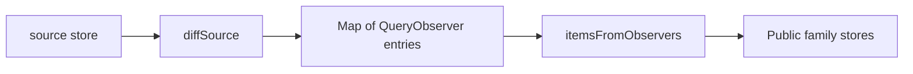
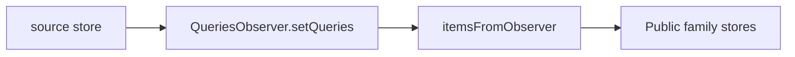

# QueriesObserver experiment — rejected as a size optimization

Delegates family observer reconciliation and subscriptions to TanStack `QueriesObserver` while retaining the existing exported functions/stores/events.

Before:



After:



## Measured result

Compared with PR18 `ca64fed`, with identical esbuild settings:

| Entry | Minified delta | Gzip delta |
| --- | ---: | ---: |
| createQueries, Query Core external | -297 B | -107 B |
| All adapter exports, dependencies external | -301 B | -109 B |
| createQueries including Query Core | +2715 B | +796 B |
| All adapter exports including Query Core | +2740 B | +816 B |

React, Effector and effector-react remain external. Importing a previously unused native observer increases the transitive footprint. Apps already using QueriesObserver may have a different marginal cost.

## Failures and differences

- Full type checking fails at `observer.setQueries`: its nongeneric input cannot retain the family's data/error/key-specific callbacks. The prototype deliberately leaves this error visible instead of adding another assertion. Reading result data still requires a native result assertion; this does not solve the type system.
- A repeated query key has different semantics. The old family uses one observer per hash, so the last selector wins for all matching items. Native QueriesObserver uses per-position observers: the differential probe returns `['A:10', 'B:10']` instead of `['B:10', 'B:10']`. Reordering also differs. Native duplicate-key warnings remain visible.
- Existing runtime suites pass with type checking disabled: 181 core + 260 React runtime tests. They do not cover the differential duplicate-key case. The normal type/test gate fails; this branch is not merge-ready.

## Reproduce

Run from this worktree root:

```sh
pnpm install --frozen-lockfile
pnpm test:types # expected failure in createQueries.ts
pnpm --filter @effector-tanstack-query/core exec vitest run --typecheck.enabled=false --coverage.enabled=false
pnpm --filter @effector-tanstack-query/react exec vitest run --typecheck.enabled=false --coverage.enabled=false
node research/observer-runtime/compare.mjs
```

The script bundles the actual baseline via `git show`, measures both revisions with and without Query Core, and asserts the duplicate-key differences. `results.json` is generated by it; do not edit independently.

Do not transfer this implementation to PR18 or treat fewer source lines as evidence of a smaller application bundle.
