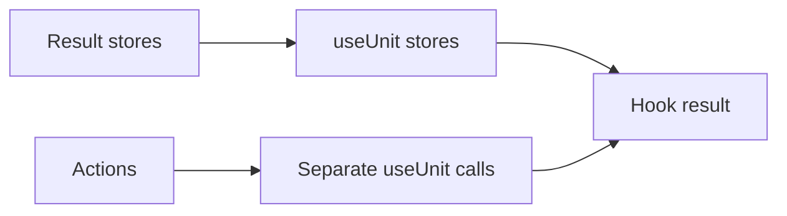
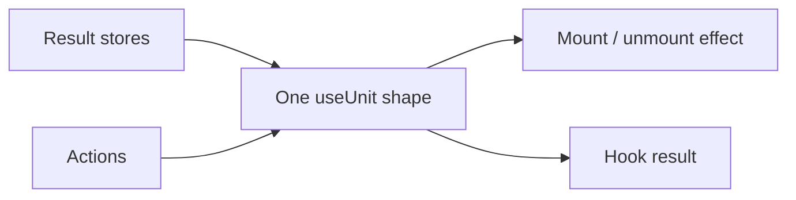

# React useUnit shape experiment

The ordinary query, infinite-query and mutation hooks read stores and bind events in one `useUnit` shape. Lifecycle-only actions are excluded from the returned result.

Before:



After:



## Results

Compared with PR18 `ca64fed`, with identical esbuild settings:

| Entry | Minified delta | Gzip delta |
| --- | ---: | ---: |
| React exports | +14 B | +14 B |
| All adapter exports, dependencies external | +14 B | +7 B |
| All exports including Query Core | +14 B | +5 B |

React, Effector and effector-react remain external. Rest destructuring offsets the reduced call-site boilerplate; this is not a bundle-size optimization.

Calls to `useUnit` change from 4 to 1 for ordinary queries and from 6 to 1 for infinite queries/mutations. No performance improvement is claimed without a render/subscription benchmark.

198 core + 268 React checks, type checks, package builds and publish checks pass. Root core/React ESM/CommonJS declarations remain byte-identical. No new assertions or observer protocols are introduced. Existing suites cover scope binding, lifecycle and result behavior; they are not a proof of equivalence for all consumers.

## Reproduce

Run from this worktree root:

```sh
pnpm install --frozen-lockfile
pnpm test
pnpm test:types
pnpm build
pnpm check:publish
node research/observer-runtime/compare.mjs
```

The script reads baseline source through `git show` and measures both revisions with identical entries. `results.json` is generated by it; do not edit independently. This experiment is retained for review and is not proposed for upstream PR18.
