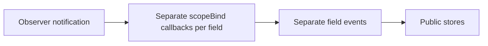
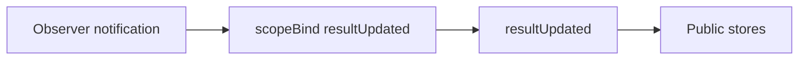

# Observer result bridge experiment

One scope-bound result event updates the existing public stores. The store SIDs, initial values and serialization shape remain unchanged. Infinite stores consume the same typed event; the separate `bindDispatcher` interface is removed. Mutation results follow the same pattern.

Before:



After:



## Measured result

Compared with PR18 `ca64fed`, using the same esbuild configuration and source entries:

| Entry | Minified delta | Gzip delta |
| --- | ---: | ---: |
| All adapter exports, dependencies external | -556 B | -264 B |
| createQuery | -191 B | -84 B |
| createInfiniteQuery | -419 B | -185 B |
| createMutation | -128 B | -54 B |
| All exports including Query Core | -574 B | -244 B |

Query Core is bundled only in the last row; React, Effector and effector-react remain external. Gzip deltas are measured on the whole entry, not added across modules.

## Behavior and compatibility

This is an intentional transaction-semantics experiment, not a transparent optimization. The differential probe captures a `sample` clocked by `$data`:

- Query/mutation baseline: new data can be paired with the previous `pending` status. Candidate: the same reaction sees `success`.
- Infinite baseline: new page data can be paired with the previous `hasNextPage: false`. Candidate: the reaction sees the updated `true`.
- Final serialized snapshots match in the probe. Root core/React ESM/CommonJS declarations are byte-identical.

Existing tests pass: 198 core + 268 React checks, `pnpm test:types`, package builds and publish checks. The probe asserts the differences and final snapshot equality. These results do not establish unchanged event ordering for every consumer or a full dependency-version matrix.

## Reproduce

Run from this worktree root:

```sh
pnpm install --frozen-lockfile
pnpm test
pnpm test:types
pnpm build
pnpm check:publish
node research/observer-runtime/compare.mjs
```

`compare.mjs` reads the actual baseline through `git show`, bundles both revisions with identical settings, and executes both probes. `results.json` is generated by the script; do not edit it independently. Temporary probe bundles are ignored under `packages/core/.cache/observer-runtime`.

Deferred by the user on 2026-10-08. Retain this as a future design direction: one scoped observer-result event, preserving public stores and SIDs. Before applying it, explicitly decide whether coherent snapshot transactions may replace the existing per-field event ordering. It is not proposed for upstream PR18.
